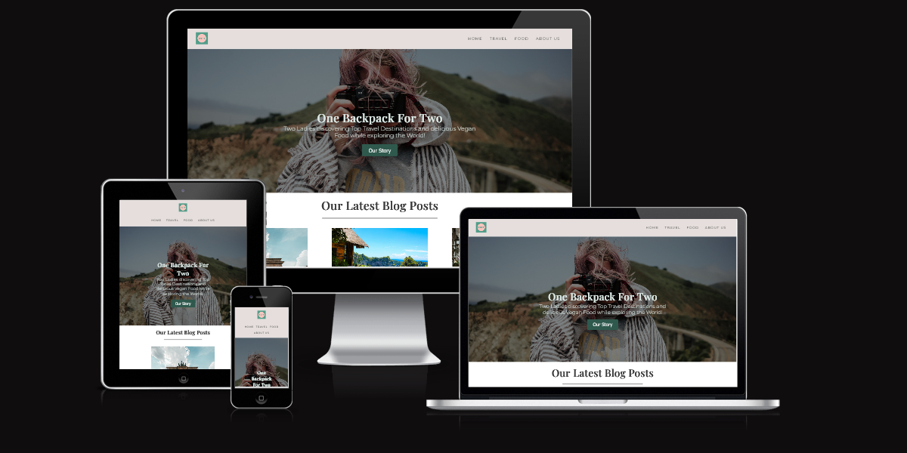

# One Backpack For Two

One Backpack For Two is a Travel and Food Blog for all the vegans and also non-vegans out there. It should provide them with some advice on finding the best spots for vegan accomodation and fantastic food businesses with a delicious vegan menu or vegan options. Lila and Saskia finding the best suited options for everyone and giving a little overview of the different discovieries in various locations. People can use it as a travel and food guide for themselves. 

## Contents

* [User Experience](#user-experience)
    * [User Stories](#user-story)
* [Design](#design)
    * [Colour Scheme](#colour-scheme)
    * [Typography](#typography)
    * [Imagery](#imagery)
    * [Wireframes](#wireframes)
* [Features](#features)
    * [General features on each page](#general-features-on-each-page)
    * [Accessibility](#accessibility)
* [Technologies Used](#technologies-used)
    * [Languages Used](#languages-used)
    * [Frameworks, Libraries & Programs Used](#frameworks-libraries-programs-used)
* [Deployment](#deployment)
* [Testing](#testing)
* [Credits](#credits)
    * [Code Used](#code-used)
    * [Content](#content)
    * [Media](#media)
    * [Acknowledgements](#acknowledgements)

## [User Experience](#user-experience)
One Backpack For Two should be a page, on which users are able to get tips for their vegan travel and vegan culinary spots.
### [User Stories](#user-story)
* First-time visitors:
    * should be able to find out what the page is about.
    * should move around the website easily.
    * should feel satisfied with the tips to become a returning visitor.
    * should want to sign up for the monthly newsletter.
* Returning visitors:
    * should be able to find newly updated content.
    * should use the travel and food tips more frequently.
## [Design](#design)
### [Colour Scheme](#colour-scheme)

This website uses a palette of green and light pink tones and some variants of the same color scheme belonging to their color family. It was created by using [Adobe Express Free Logo Maker](#https://www.adobe.com/express/create/logo).

### [Typography](#typography)
I have imported the following Google Fonts:
* Playfair Display 500 for headings on website.
* Montserrat 300 for the body text on the website.

### [Imagery](#imagery)
Imagery is used regarding the travel and food content on the website. They are taken of various websites, which are credited down below in the [Credits](#credits) section.

### [Wireframes](#wireframes)
I have used [Adobe XD](#https://www.adobe.com/ie/products/xd.html) to create the wireframes. Each wireframe stands for the four different .html pages. Boxes with an X-line stand for an image. Subject is to change during the production of this website.

## [Features](#features)
### [General features on each page](#general-features-on-each-page)

The website consists of a Homepage, Travel page, Food page and an AboutUs page.

All of the pages contain:
* A responsive navigation bar:
    * Logo is positioned on the left hand side.
    * The other navigtion links (Home, Travel, Food, About Us) are located to the left.
    * The color is a shade of light grey. 

* A responsive footer:
    * The footer contains the social media icons of Facebook, Instagram, Twitter and Pinterest, that open all in a new tab when clicked on.

### The Home Page

The Homepage as Main page contains the navigation bar at the top and the footer at the bottom and is divided into three sections.
#### Section 1 : Hero Image with Title

* The Hero image is a background image just below the navigation bar with the page's main title "One Backpack For Two" placed in the middle of it with a quick small summary of what the page itself is about. Underneath is a button "Our Story" positioned, which, when clicked, will bring you to the About Us page.

#### Section 2 : Latest Blog Posts Summary

* The latest Blog Posts section contains three of the newest blog posts available on the website.
* Each of the posts contain an image, a title and a quick summary of what to expect in the post.
* Images, title and the "Top ..." are clickable links and bring you, when clicked, to each of the individual contents.

#### Section 3 : Newsletter Sign-Up Form

* The newsletter sign-up form allows the user to sign-up to receive a monthly newsletter about newly added travel or food tips.
* When form is submitted user is brought to [CI's form dump page](https://formdump.codeinstitute.net/). 
* Form fields are required to be filled in before hitting the submit button. 

### The Travel Page

The Travel Page is a regularly updated page containing all the travel posts on this website.
* The main heading of Travel Posts on the top of the page.
* Below the main heading is the article located with a sub-heading, the same image as on the homepage, the date, when the article was created, the contents of the blog post with selected imagery for each blog post and a quick summary at the end.

### The Food Page

The Food Page is a regularly updated page containing all the food posts on this website.
* The main heading of Food Posts on the top of the page.
* Below the main heading is the article located with a sub-heading, the same image as on the homepage, the date, when the article was created, the contents of the blog post with selected imagery for each blog post and a quick summary at the end.

### The About Us Page

The About Us page gives the user the information about the creators of the website.
* The main heading "Who we are".
* A headshot of both women. 
* A short paragraph about each individual to give the user some idea of who they are, what they are doing and why.

### [Accessibility](#accessibility)

* For better accessibilty i I added alt-labels to all my images for vision impaired users.
* To acchieve the required colour contrast I used the tool [Colour Contrast Checker](#https://colourcontrast.cc/).

## [Technologies Used](#technologies-used)

### [Languages Used](#languages-used)

* *HTML*
* *CSS*

### [Frameworks, Libraries & Programs Used](#frameworks-libraries-programs-used)

* [Adobe XD](#https://www.adobe.com/ie/products/xd.html) to create the wireframes.
* [Git](#https://git-scm.com/) for version control.
* [Gitpod](#https://www.gitpod.io/) for writing down the code and creating the website.
* [Github](#https://github.com/) to save and store the progress and files used on the website.
* [Google Fonts](#https://fonts.google.com/) to import the fonts used on the website.
* [Adobe Logo Maker](#https://www.adobe.com/express/create/logo) to create the logo.
* [Font Awesome](#https://fontawesome.com/) for the icons used on this website.
* [W3C Validator](#https://validator.w3.org/) to validate HTML.
* [W3C Jigsaw Validator](#https://jigsaw.w3.org/css-validator/) to validate CSS.
* [Image Converter](#https://www.reduceimages.com/ ) to reduce size of images.
* [Google Developer Tools](#https://developer.chrome.com/docs/) to test code or solve issues and too use lighthouse.
* [Mozzilla Developer Tools](#https://firefox-source-docs.mozilla.org/devtools-user/) to test code or solve issues.
* [Am I Responsive](#https://ui.dev/amiresponsive) to document the responsiveness on different devices.

## [Deployment](#deployment)

This project was created by using Gitpod. I used the pre-built template from [Code Institue](#https://github.com/Code-Institute-Org/gitpod-full-template).
The following commands where used:
* **python3 -m http.server** - to run a local server to view the project.
* **git add .** - to add all the changes.
* **git commit -m "..."** - to commit all the changes to the local repository.
* **git push** - to push the commited changes to the Github repository.

### Deployment using Github
1. Navigate to [project repository](#https://github.com/sinastiller/vegan-travel-food-blog).
2. Click on the Settings Tab.
3. Scroll down to pages.
4. For the source select main branch.
5. Click save.
6. Open the link provided by Github to go to deployed website.

## [Testing](#testing)

Please find the carried out testing on [TESTING.md](TESTING.md).

## [Credits](#credits)
    
### [Code Used](#code-used)
 * The [Love Running Project](#https://github.com/sinastiller/love-running) was referenced throught the website.
 * [W3C Schools](#https://www.w3schools.com/) was referenced throught the project for html syntax and styling.
 * [YouTube](#https://www.youtube.com/) has been a great resource for tutorials and explanations.
 * [Link1](#https://www.youtube.com/watch?v=fYq5PXgSsbE), [Link2](#https://www.youtube.com/watch?v=FTlczfR82mQ) and [CSS Tricks](#https://css-tricks.com/snippets/css/a-guide-to-flexbox/) helped me to learn about Flexbox and introduce it into my project.
 * [YouTube Video](#https://www.youtube.com/watch?v=QNVrgzV66rY) used as a guide when creating the blog post cards on the Homepage.
 * [MDN Web Docs](#https://developer.mozilla.org/en-US/docs/Web/CSS/::placeholder) guided me to style the placeholder text for the newsletter form inputs.
 * [W3C](#https://www.w3schools.com/css/tryit.asp?filename=trycss_form_focus2) was used as a guide to focus the border of the newsletter input fields.
 * [Kera Cudmore's Milestone1 Template](#https://github.com/kera-cudmore/readme-examples/blob/main/milestone1-readme.md#futute-implementations) was used as a guide for the README.md.

## [Content](#content)

* All the text-content on the website was written by myself. I have travelled to various places and used my knowledge and research to create the posts.
* The imagery was taken from various websites of the internet.

## [Media](#media)

* [Unsplash](#http://www.unsplash.com/) for various images.
* [Pexels](#http://www.pexels.com/ ) for various images.
* [The Shanti Residence](#https://www.booking.com/hotel/id/the-shanti-residence.en-gb.html?aid=356980&label=gog235jc-1DCAsoaEIUdGhlLXNoYW50aS1yZXNpZGVuY2VIM1gDaGmIAQGYAQm4ARfIAQ_YAQPoAQGIAgGoAgO4Ao338ZgGwAIB0gIkZmQwMWFiNTMtMTk1MS00OTNkLWI2YjgtMDY0NzNhZjg2ZDAx2AIE4AIB&sid=d91204a5d2838517aa44934bc484de36&dist=0&keep_landing=1&sb_price_type=total&type=total&
)
* [Chapung Sebali](#https://www.onceinalifetimejourney.com/reviews/hotel-resorts/chapung-se-bali-ubuds-sexy-hip-resort/)
* [Bali Eco Stay](#https://www.baliecostay.com/)
* [Cafe Vux](#https://www.happycow.net/reviews/cafe-vux-berlin-19181)
* [Kopps](#https://www.kopps-berlin.de/de/food/)
* [FREA](#https://www.tripadvisor.com/Restaurant_Review-g187323-d16818974-Reviews-FREA-Berlin.html)
* [Brammibals Donuts](#https://www.brammibalsdonuts.com/ )
* [Lucky Leek](#https://www.forberlinlovers.com/en/8-of-the-best-vegan-and-vegetarian-restaurants-in-berlin)
* [Cornucopia](#https://cornucopia.ie/)
* [Veginity](#https://veginity.com/index.php/menu)
* [Glas Restaurant](#https://glasrestaurant.ie/)

## [Acknowledgements](#acknowledgements)

I would like to thank my mentor Jubril Akolade for his guidance, time and patience throughout the process of the project and the awesome Slack Community for always giving the much needed push and advice to stay motivated and eager to acchieve the end result!

