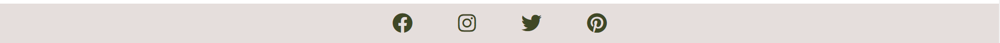

# One Backpack For Two

One Backpack For Two is a Travel and Food Blog all the vegans and also non-vegans out there. It should provide them with some advice on finding the best spots for vegan accomodation and fantastic food businesses with a delicious vegan menu or vegan options. Lila and Saskia finding the best suited options for everyone and giving a little overview for the different discovieries in various locations. People can use it as a travel and food guide for themselves. 

## Contens

* [User Experience](#user-experience)
    * [User Stories](#user-story)
* [Design](#design)
    * [Colour Scheme](#colour-scheme)
    * [Typography](#typography)
    * [Imagery](#imagery)
    * [Wireframes](#wireframes)
* [Features](#features)
    * [General features on each page](#general-features-on-each-page)
    * [Accessibility](#accessibility)
* [Technologies Used](#technologies-used)
    * [Languages Used](#languages-used)
    * [Framworks, Libraries & Programs Used](#frameworks-libraries-programs-used)
* [Deployment & Local Development](#deployment&local-development)
    * [Deployment](#deployment)
* [Testing](#testing)
* [Credits](#credits)
    * [Code Used](#code-used)
    * [Content](#content)
    * [Media](#media)
    * [Acknowledgements](#acknowledgements)

## [User Experience](#user-experience)
One Backpack For Two should be a page, on which users are able to get tips for their vegan travel and culinary spots.
### [User Stories](#user-story)
* First-time visitors:
    * should be able to find out what the page is about.
    * should move around the website easily.
    * should feel satisfied with the tips to become a returning visitor.
    * should want to sign up for the monthly newsletter.
* Returning visitors:
    * should be able to find newly updated content.
    * should use the travel and food tips more frequently.
## [Design](#design)
### [Colour Scheme](#colour-scheme)

This website uses a palette of green and light pink tones and some variants of the same color scheme belonging to their color family. It was created by using [Adobe Express Free Logo Maker](#https://www.adobe.com/express/create/logo).

### [Typography](#typography)
I have imported the following Google Fonts:
* Playfair Display 500 for headings on website.
* Montserrat 300 for the body text on the website.

### [Imagery](#imagery)
Imagery is used regarding the travel and food content on the website. They are taken of various websites, which are credited down below in the [Credits](#credits) section.

### [Wireframes](#wireframes)
I have used [Adobe XD](#https://www.adobe.com/ie/products/xd.html) to create the wireframes. Each wireframe stands for the four different .html pages. Boxes with an X-line stand for an image. Subject is to change during the production of this website.

## [Features](#features)
### [General features on each page](#general-features-on-each-page)

The website consists of a Homepage, Travel page, Food page and an AboutUs page.

All of the pages contain:
* A responsive navigation bar:
    * Logo is positioned on the left hand side.
    * The other navigtion links (Home, Travel, Food, About Us) are located to the left.
    * The color is a shade of light grey. 

* A responsive footer:
    * The footer contains the social media icons of Facebook, Instagram, Twitter and Pinterest and open all on a new tab when clicked on.

### The Home Page

The Homepage as Main page contains the navigation bar at the top and the footer at the bottom and is divided into three sections.
#### Section 1 : Hero Image with Title

* The Hero image is a background image just below the navigation bar with the page's main title "One Backpack For Two" placed in the middle of it with a quick small summary of what the page itself is about. Underneath is a button "Our Story" positioned, which, when clicked, will bring you to the About Us page.

#### Section 2 : Latest Blog Posts Summary

* The latest Blog Posts section contains three of the newest blog posts available on the website.
* Each of the posts contain an image, a title and a quick summary of what to expect in the post.
* Images, title and the "Top ..." are clickable links and bring you, when clicked, to each of the individual contents.

#### Section 3 : Newsletter Sign-Up Form

* The newsletter sign-up form allows the user to sign-up to receive a monthly newsletter about newly added travel or food tips.
* When form is submitted user is brought to [CI's form dump page](https://formdump.codeinstitute.net/). 
* Form fields are required to be filled in before hitting the submit button. 

### The Travel Page

The Travel Page is a regularly updated page containing all the travel posts on this website.
* The main heading of Travel Posts on the top of the page.
* Below the main heading is the article located with a sub-heading, the same image as on the homepage, the date, when the article was created, the contents of the blog post with selected imagery for each blog post and a quick summary at the end.

### The Food Page

The Food Page is a regularly updated page containing all the food posts on this website.
* The main heading of Food Posts on the top of the page.
* Below the main heading is the article located with a sub-heading, the same image as on the homepage, the date, when the article was created, the contents of the blog post with selected imagery for each blog post and a quick summary at the end.

### The About Us Page

The About Us page gives the user the information about the creators of the website.
* The main heading "Who we are".
* A headshot of both women. 
* A short paragraph about each individual to give the user some idea of who they are, what they are doing and why.

