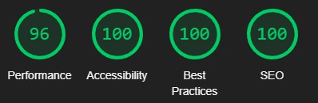

# TESTING FOR ONE BACKPACK FOR TWO

## Contents
 * [Automated Testing](#automatedtesting)
    * [W3C Validator](#w3cvalidator)
    * [Responsivness](#responsivness)
    * [Lighthouse](#lighthouse)
* [Manual Testing](#manualtesting)
* [Bugs](#bugs)

## [Automated Testing](#automatedtesting)

### [W3C Validator](#w3cvalidator)

To verify that the HTML code is written in the correct structure, I tested each .html individually. There are currently no errors, as i have fixed these.

To verify that the CSS code is written to correct standards, I tested style.css using W3C Jigsaw. There are currrently no errors.

### [Responsivness](#responsivness)

* The website was tested on different screen sizes and devices to ensure outstanding responsiveness. It has been tested on a large screen, lapotp, Ipad Mini, IPhoneX, IPhone8, Xiaomi 9, IPhone SE. It also has been tested in landscape mode.
* The website was tested on Mozzilla Firefox, Chrome, Safari and Microsoft Edge.

### [Lighthouse](#lighthouse)

Lighthouse was used to test the performance, accessibilty, best practices and SEO. My website acchieved a high rating for all of the .html pages.

* **HOME**

* **TRAVEL**

* **FOOD**

* **ABOUT US**

## [Manual Testing](#manualtesting)

| FEATURE | EXPECTED OUTCOME| ACTION | RESULT |
| -------------              | -------------                                | ------------- | ------------- |
| Navigation food.html Links | When clicked go to individual food.html page | Click on link | food.html opens |
| Our Story Button | When clicked go to aboutus.html | Click on button |  aboutus.html opens  |
| Logo in Navigation Bar | When clicked return to Homepage | Click on logo | index.html opens |
| Blog post image on Homepage | When image is hovered over, you should see opacity during transition | Hover over image | opacity transition |
| Title of Blog Post on Homepage | Go to desired food.html or travel.html | Click on title | food.html or travel.html opens |
| Newsletter submit form | User is brought to a new page | Click on submit button | New page opens and form submitted successfuly |
| Form validation | First name and email address field required to be filled out to submit form successfully | User types in first name and email address | Form submitted successfully |
| Social media icons | New tab opens with social media website | Click on icon | New tab opens with social media website |

## [Bugs](#bugs)

The following bugs were identified during testing and fixed accordingly :

* ID attributes for labels were removed to have correct html syntax.
* I removed the heights for Latest Blog Post section, Newsletter Section and About Us Section and added margins for a better responsiveness.
* I fixed the structure on travel.html as an ordered list is not allowed to contain an img element or a paragraph. 
* I removed the a element for the "Our Story" Button and replaced it with a form element to acchieve the desired result.
* When trying to make the navigation bar responsive, I was left with a lot of problems. I decided therefore to change the whole header into a flexbox.
* Giving the footer a max-height helped making it better responsive.
* The input field for email address in the form had the incorrect value, so i had to fix it to acchieve the dessired result.
* When hitting the submit button for the newsletter form an error 404 page opened. I inserted the action to have it open to Code Institutes's form dump.
* Resizing all the images on travel.html and food.html to be identical in size to acchieve better responsiveness. 